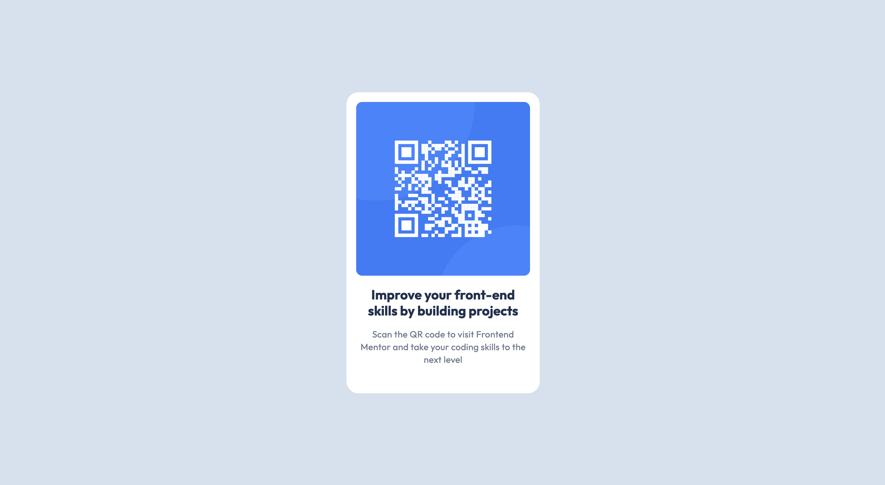
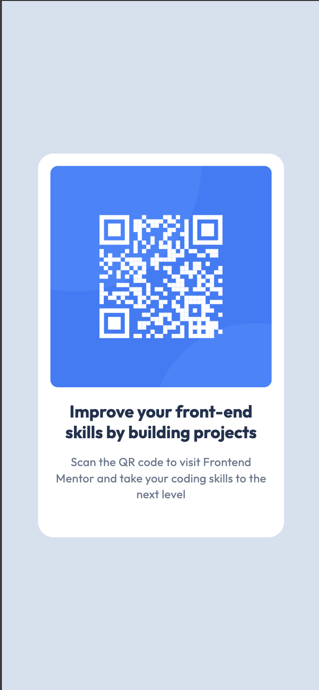

# QR Code Component

A clean and responsive QR code component built as a solution to the [Frontend Mentor QR code component challenge](https://www.frontendmentor.io/challenges/qr-code-component-iux_sIO_H).

## 🚀 Live Demo

[View Live Demo](http://localhost:8000) (when running locally)

## 📱 Screenshot

Desktop View

Mobile View

## ✨ Features

- **Responsive Design**: Works perfectly on all device sizes
- **Modern Typography**: Uses Google Fonts (Outfit) for clean, professional text
- **Accessible**: Proper semantic HTML and alt text for images
- **Clean Layout**: Centered card design with proper spacing and shadows
- **Cross-browser Compatible**: Works on all modern browsers

## 🛠️ Built With

- **HTML5**: Semantic markup structure
- **CSS3**: Modern styling with Flexbox
- **Google Fonts**: Outfit font family (400 & 700 weights)
- **Responsive Design**: Mobile-first approach

## 🎨 Design Specifications

### Typography
- **Heading**: Outfit Bold, 22px, 120% line height, 0px letter spacing
- **Body Text**: Outfit Regular, 15px, 140% line height, 0.2px letter spacing

### Colors
- **Background**: #d5e1ef (Light blue-gray)
- **Card Background**: #ffffff (White)
- **Heading Text**: #1f314f (Dark blue)
- **Body Text**: #68778d (Medium gray)

### Layout
- **Card Dimensions**: 320px × 499px
- **Border Radius**: 20px
- **Padding**: 16px
- **Image Border Radius**: 10px

## 💡 Key Learnings

### CSS Flexbox Mastery
### Google Fonts Integration
### Responsive Image Handling
### Card Component Design

## 🎯 Challenges Solved

1. **Font Loading**: Switched from local font files to Google Fonts for better reliability
2. **Responsive Design**: Implemented flexible layout that works on all screen sizes
3. **Typography Matching**: Precisely matched Figma design specifications

## 🙏 Acknowledgments

- [Frontend Mentor](https://www.frontendmentor.io/) for providing this amazing challenge
- [Google Fonts](https://fonts.google.com/) for the beautiful Outfit font family
- The web development community for inspiration and best practices

---
